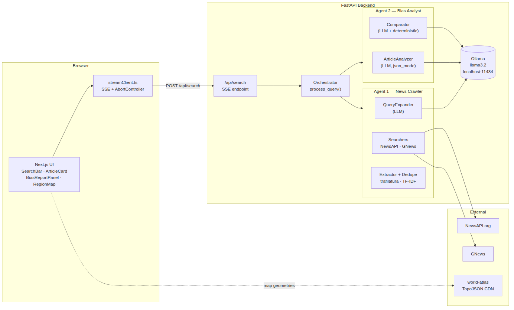
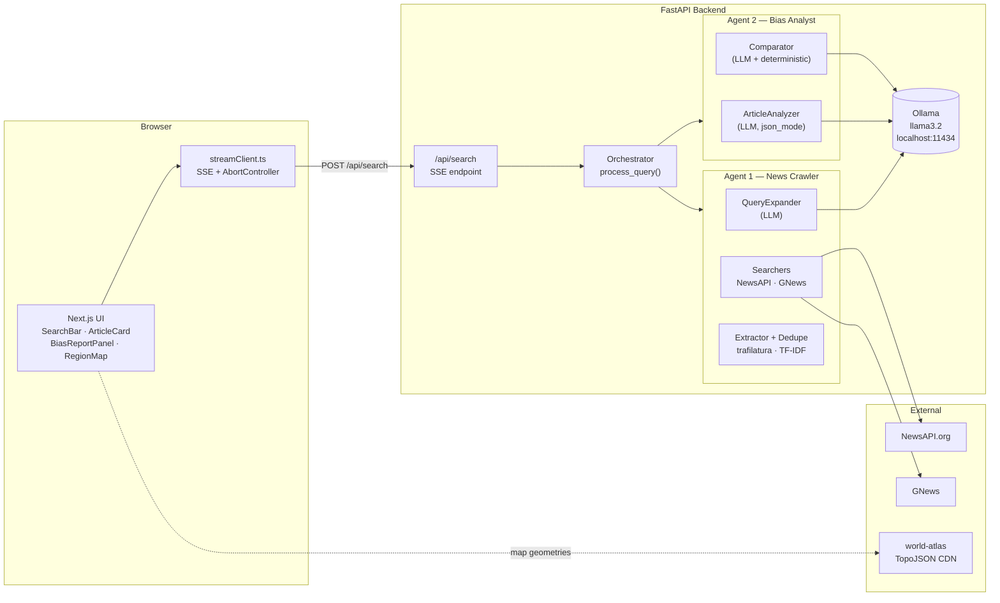
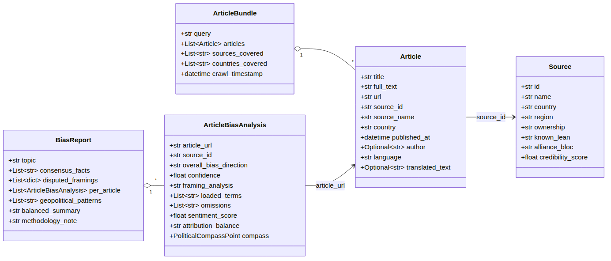
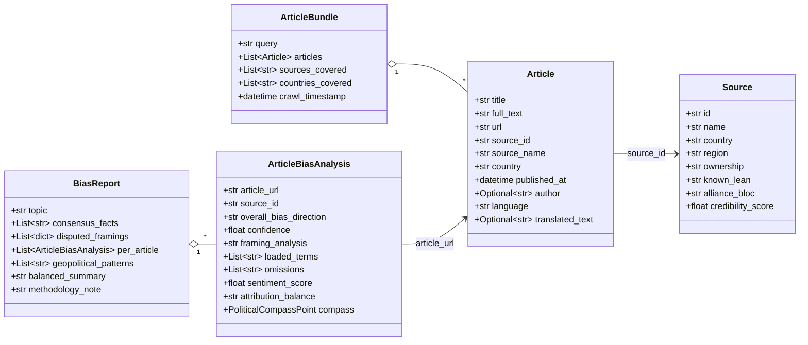
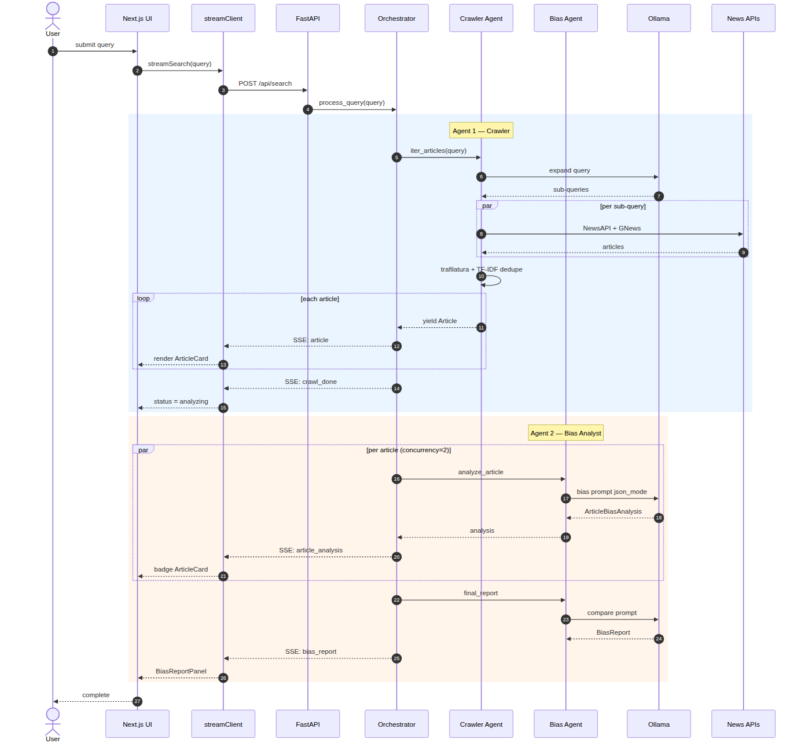
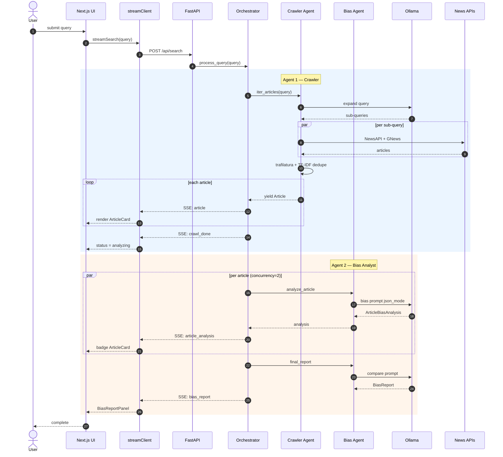
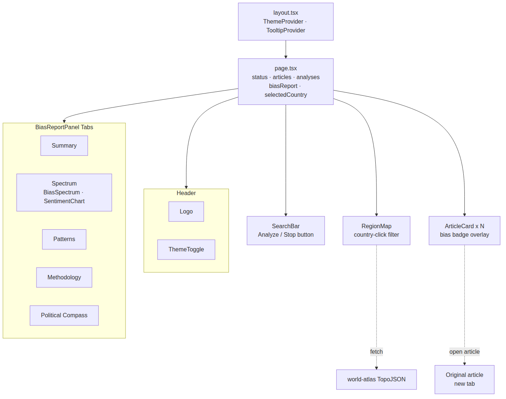
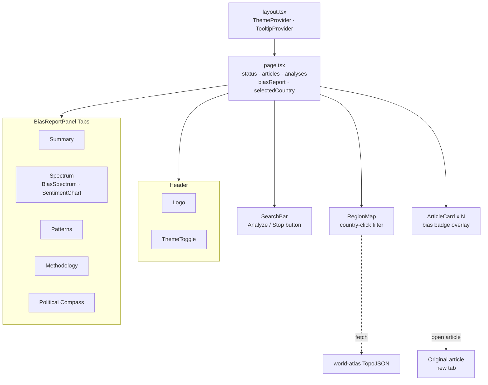
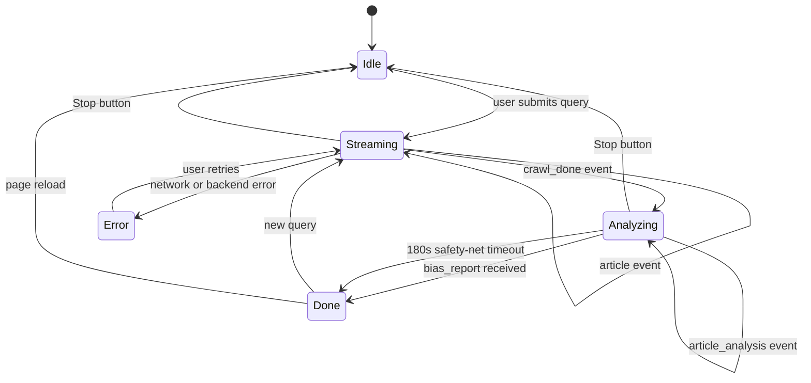

# Lighthouse — Architecture Diagrams

> Backlog: [Lighthouse on Linear](https://linear.app/the-lighthouse-project/project/lighthouse-news-bias-report-d2f5d9dca425/overview)
> · See also [`../DESIGN.md`](../DESIGN.md)

Diagrams are stored as PNG files in [`diagrams/`](diagrams/) and embedded below. To regenerate after editing a source block, run:

```bash
npx @mermaid-js/mermaid-cli -i input.mmd -o docs/diagrams/name.png -w 1400 -b white
```

---

## 1. System topology — component diagram

The app is a browser → Next.js → FastAPI stack. The two AI agents live inside the FastAPI backend and are chained by the orchestrator. All LLM inference runs locally via Ollama.



<details>
<summary>Mermaid source</summary>



</details>

---

## 2. Domain model — class diagram

Mirrors the Pydantic models in `backend/app/models/` and the TypeScript interfaces in `frontend/lib/streamClient.ts`.



<details>
<summary>Mermaid source</summary>



</details>

---

## 3. End-to-end flow — sequence diagram

From keystroke to fully rendered UI: SSE stream, both agents, progressive hydration.



<details>
<summary>Mermaid source</summary>



</details>

---

## 4. React component tree — frontend diagram

How the Next.js components compose and which data each consumes.



<details>
<summary>Mermaid source</summary>



</details>

---

## 5. Search lifecycle — state machine

Frontend status transitions driven by SSE events from the backend.


<details>
<summary>Mermaid source</summary>



</details>
