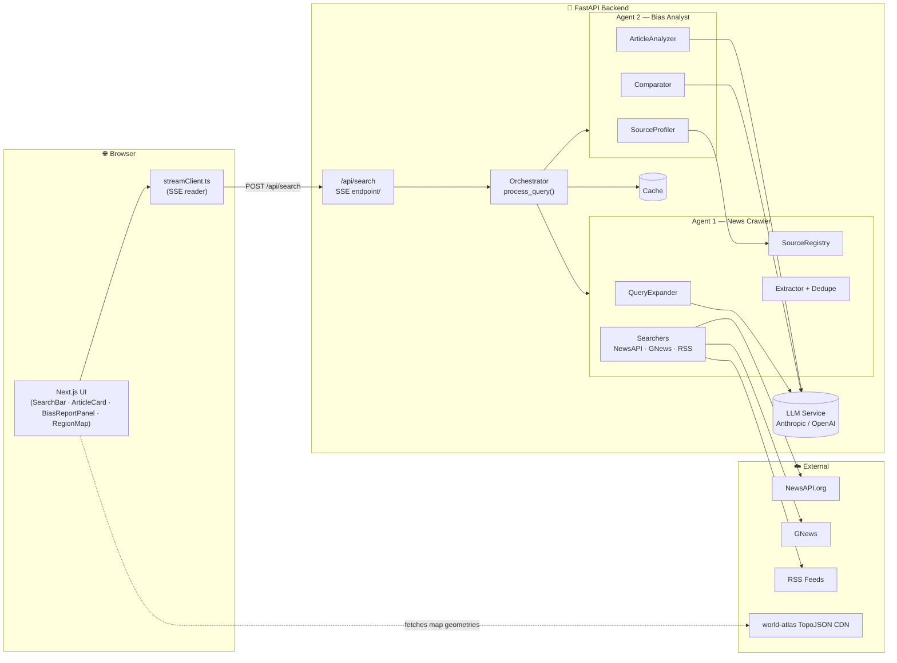
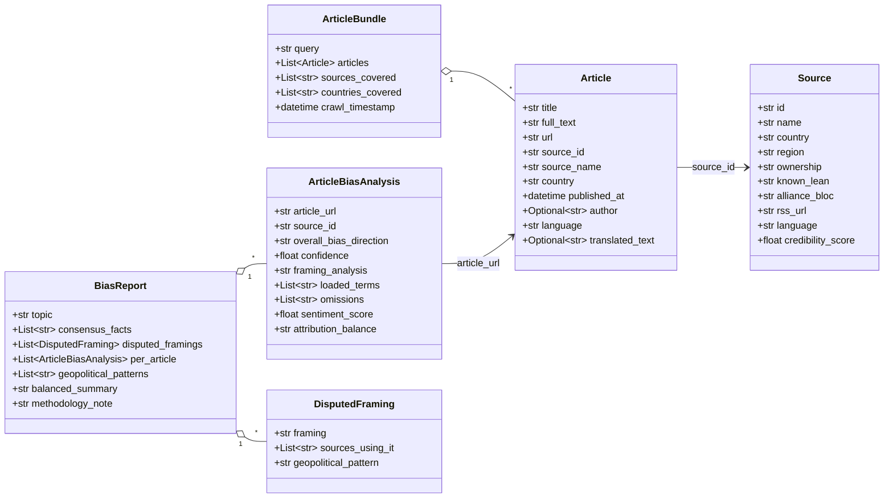
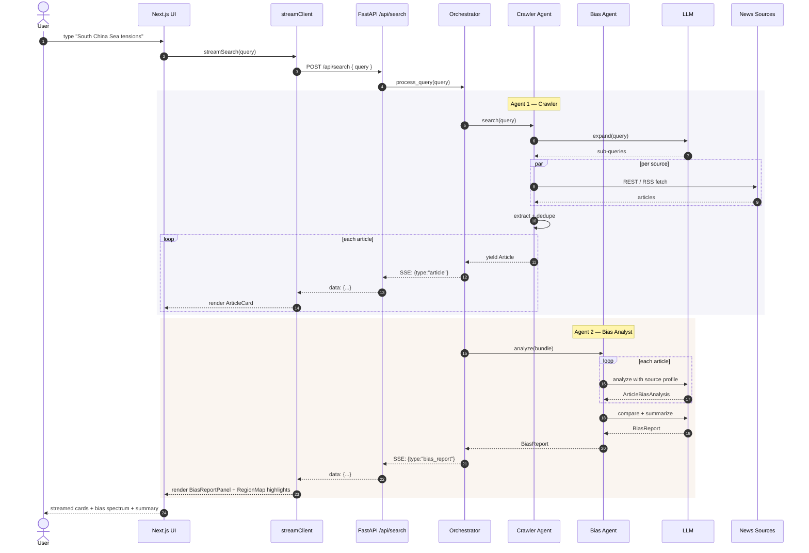
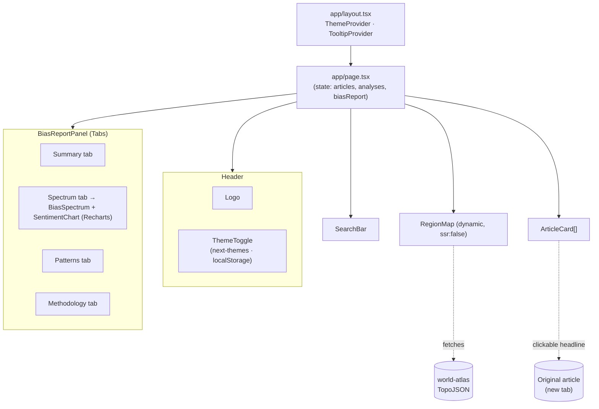
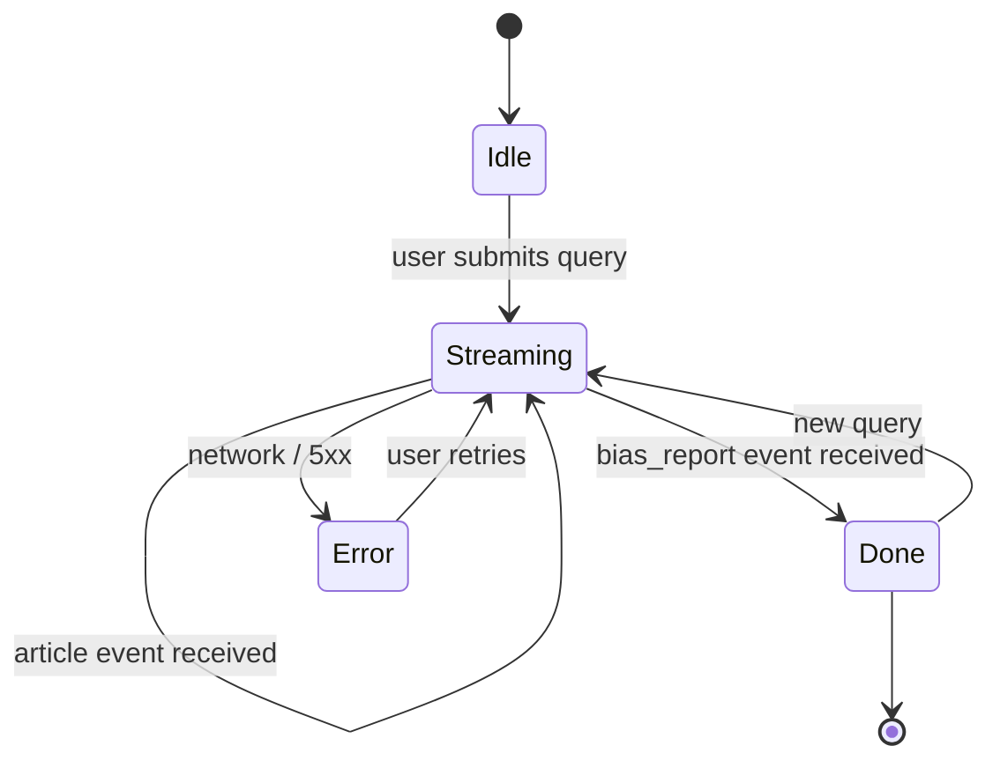

# Lighthouse — Architecture UML

This document captures the system architecture of the Lighthouse News Bias
Report app as a set of UML diagrams. All diagrams use Mermaid so they
render natively on GitHub and in most Markdown viewers.

> Source of truth: [Lighthouse News Bias Report on Linear](https://linear.app/the-lighthouse-project/project/lighthouse-news-bias-report-d2f5d9dca425/overview)
> · See also [`../DESIGN.md`](../DESIGN.md).

---

## 1. Component diagram — system topology

The app is a thin browser → Next.js → FastAPI → external-tool stack. The
two AI agents live inside the FastAPI backend and are chained by the
orchestrator.

---

## 2. Class diagram — domain model

Mirrors the dataclasses defined in `backend/app/models/` and the
TypeScript interfaces in `frontend/lib/streamClient.ts`.

---

## 3. Sequence diagram — a single user query

End-to-end: keystroke → SSE stream → both agents → progressive UI
hydration.

---

## 4. Frontend component diagram

How the React components compose, and which data they consume.

---

## 5. State machine — search lifecycle

